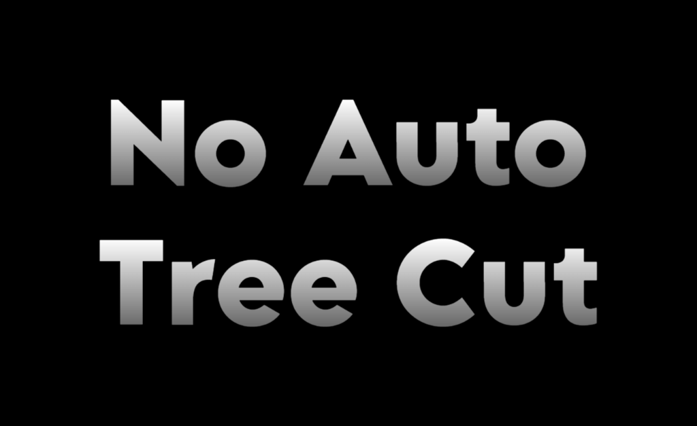

# 

WARNING: ALPHA VERSION, NOT FULLY TESTED!

Prevent your pawns automatically cutting trees and uproot them instead!

**Commissioned in the RimWorld Mod Market**

## Features

Replaces tree cutting jobs with extract jobs when a tree blocks building, roofing, or farming.

This behaviour can be changed using the provided mod settings.

## Future Plans

I plan to add support for automatically switching the behaviour based on pawn views / ideoligion
and adjusting the available settings to switch the extraction behaviour between OFF, AUTO, and ON.

## Existing Saves

DISREGARD THIS FOR ALPHA VERSION

This mod should be safe to add or remove from saves.

## Attributions

- Mod title image generated at [Text Studio](https://www.textstudio.com/)

## Bugs and Requests

Let me know if there are any bugs or requests, I'll happily do my best to fix them up!

Open to contributions and suggestions!
